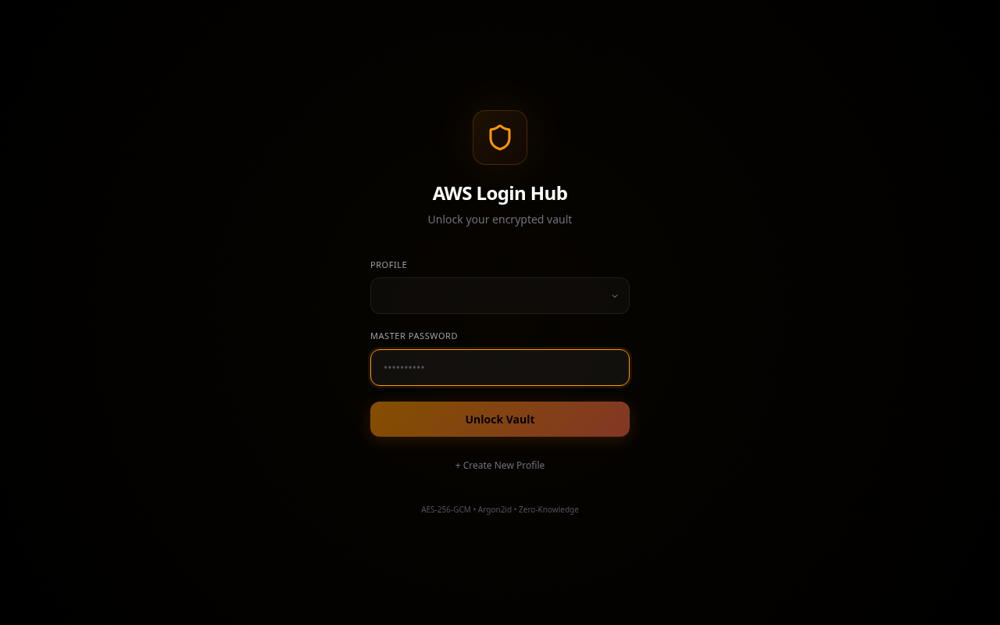
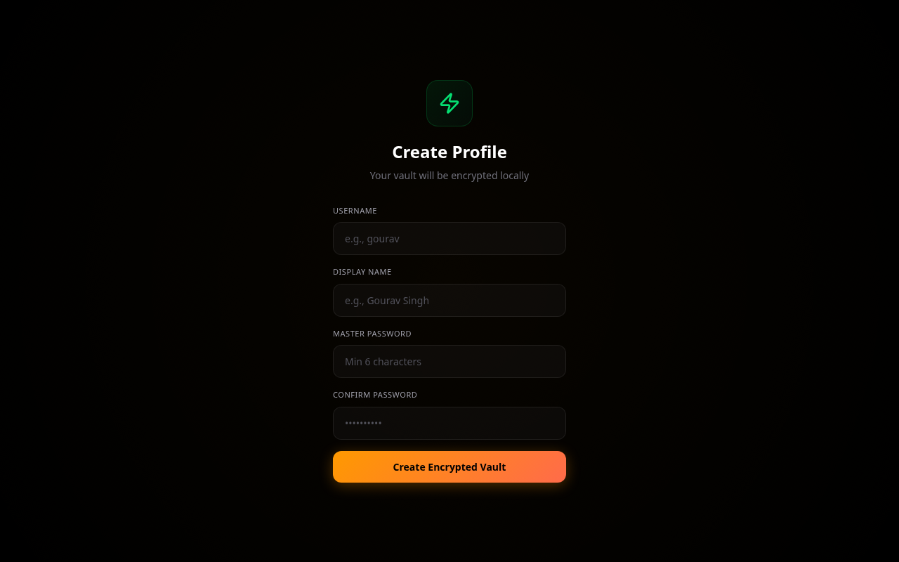
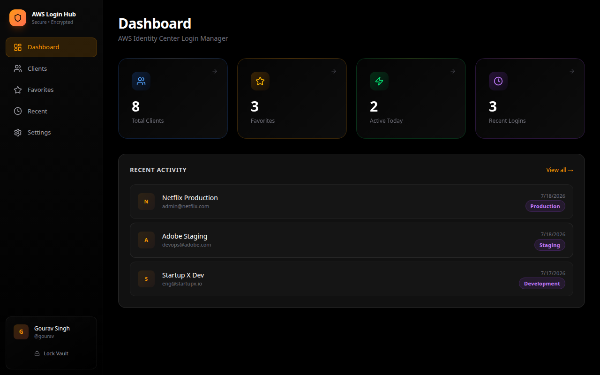
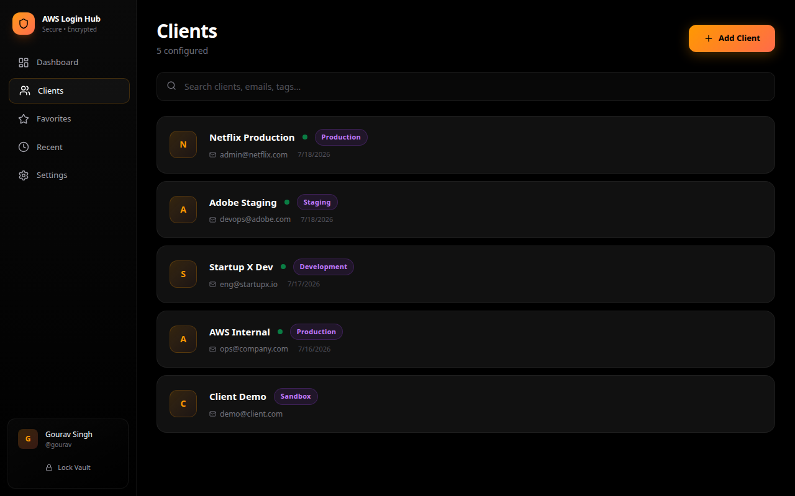
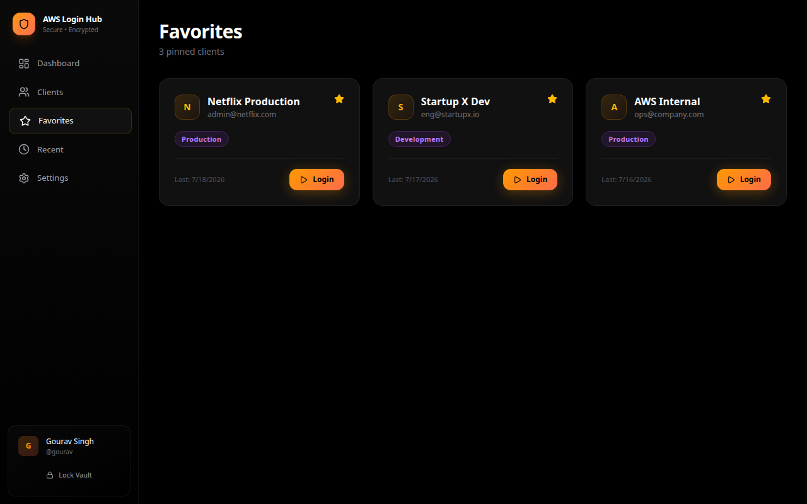
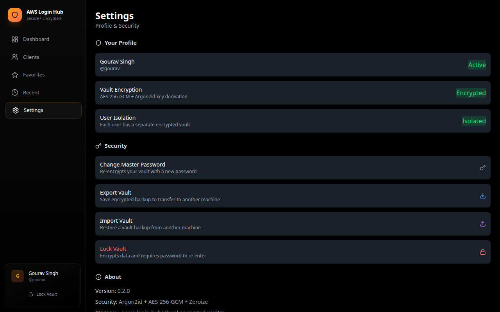

<p align="center">
  
  
  
  
  
</p>

# 🔐 AWS Login Hub

A premium desktop application for managing multiple AWS Identity Center (AWS SSO) client logins with **military-grade encryption**, **browser automation**, and **cross-platform support**.

---

## 📸 Screenshots

### 🔒 Vault Unlock Screen
<p align="center">
  
</p>

### 👤 Create Profile
<p align="center">
  
</p>

### 📊 Dashboard
<p align="center">
  
</p>

### 👥 Clients Management
<p align="center">
  
</p>

### ⭐ Favorites
<p align="center">
  
</p>

### ⚙️ Settings & Security
<p align="center">
  
</p>

---

## ✨ Features

| Feature | Description |
|---------|-------------|
| 🔒 **Encrypted Vault** | AES-256-GCM encryption with Argon2id key derivation |
| 👥 **Multi-User Isolation** | Each user has a separate encrypted vault — User A cannot see User B's data |
| 🌐 **Browser Automation** | Playwright-based auto-login (email, password fill) with MFA pause |
| 📦 **Export/Import** | Transfer your vault between machines via encrypted backup files |
| ⭐ **Favorites** | Pin frequently-used clients for one-click access |
| 🔍 **Instant Search** | Search by client name, email, tags, or environment |
| 🕐 **Auto-Lock** | Vault auto-locks after 15 minutes of inactivity |
| 🎨 **Premium UI** | Apple/Stripe/Vercel-inspired dark theme with animations |
| 💻 **Cross-Platform** | Works on Linux, Windows, and macOS |

---

## 🏗️ Architecture

```
┌─────────────────────────────────────────────────────────┐
│                    AWS Login Hub                          │
├─────────────────────────────────────────────────────────┤
│  Frontend (React + TypeScript + Tailwind + Framer Motion)│
├─────────────────────────────────────────────────────────┤
│  Tauri IPC Bridge                                        │
├─────────────────────────────────────────────────────────┤
│  Backend (Rust)                                          │
│  ├── Vault (AES-256-GCM + Argon2id)                    │
│  ├── SQLite (client metadata)                           │
│  ├── Playwright Runner (Node.js subprocess)             │
│  └── File Dialog (native OS)                            │
├─────────────────────────────────────────────────────────┤
│  OS Layer                                                │
│  └── ~/.aws-login-hub/ (encrypted vault files)          │
└─────────────────────────────────────────────────────────┘
```

---

## 🔐 Security Model

```
Master Password (never stored)
        ↓
Argon2id Key Derivation (memory-hard, GPU-resistant)
        ↓
256-bit Encryption Key (held in memory only while unlocked)
        ↓
AES-256-GCM Encrypts/Decrypts vault file
        ↓
Vault auto-locks → key zeroed from memory (zeroize crate)
```

**Security guarantees:**
- ❌ Passwords are NEVER stored in plaintext
- ❌ Master password is NEVER saved to disk
- ❌ No network calls — everything is local
- ✅ Vault file is useless without the master password
- ✅ Each user's vault is independently encrypted
- ✅ Keys are securely wiped from RAM on lock

---

## 📦 Installation

### Option 1: Ubuntu / Debian (Recommended)

Copy-paste these 3 commands:

```bash
wget https://github.com/Gourav-Singh-Comprinno/aws-login-hub/releases/download/v0.2.0/aws-login-hub_0.2.0_amd64.deb
sudo dpkg -i aws-login-hub_0.2.0_amd64.deb
aws-login-hub
```

That's it. The app is installed and running. Find it in your application menu as "AWS Login Hub".

To uninstall later:
```bash
sudo apt remove aws-login-hub
```

---

### Option 2: Fedora / RHEL / CentOS

```bash
wget https://github.com/Gourav-Singh-Comprinno/aws-login-hub/releases/download/v0.2.0/aws-login-hub-0.2.0-1.x86_64.rpm
sudo rpm -i aws-login-hub-0.2.0-1.x86_64.rpm
aws-login-hub
```

To uninstall:
```bash
sudo rpm -e aws-login-hub
```

---

### Option 3: Any Linux (AppImage — No Install Needed)

```bash
wget https://github.com/Gourav-Singh-Comprinno/aws-login-hub/releases/download/v0.2.0/aws-login-hub_0.2.0_amd64.AppImage
chmod +x aws-login-hub_0.2.0_amd64.AppImage
./aws-login-hub_0.2.0_amd64.AppImage
```

No root/sudo needed. Just download, make executable, and run.

---

### Option 4: Windows

> Build from source on a Windows machine (see Build From Source below).
> Windows `.msi` installer will be available in future releases.

```powershell
git clone https://github.com/Gourav-Singh-Comprinno/aws-login-hub.git
cd aws-login-hub
npm install
npm run tauri build
# Output: src-tauri\target\release\bundle\msi\AWS Login Hub_0.2.0_x64.msi
# Double-click the .msi to install
```

---

### Option 5: macOS

> Build from source on a Mac (see Build From Source below).
> macOS `.dmg` installer will be available in future releases.

```bash
git clone https://github.com/Gourav-Singh-Comprinno/aws-login-hub.git
cd aws-login-hub
npm install
npm run tauri build
# Output: src-tauri/target/release/bundle/dmg/AWS Login Hub_0.2.0_x64.dmg
# Double-click the .dmg to install
```

---

### After Installation: Setup Playwright (Required for Login Automation)

```bash
npm install -g playwright
npx playwright install chromium
```

Without this, the app will work for storing credentials but the "Login" button won't be able to automate the browser.

---

## 🛠️ Build From Source

### Prerequisites

| Tool | Version | Install |
|------|---------|---------|
| **Node.js** | 18+ | `nvm install 18` |
| **Rust** | 1.70+ | `curl --proto '=https' --tlsv1.2 -sSf https://sh.rustup.rs \| sh` |
| **Playwright** | Latest | `npm install -g playwright && npx playwright install chromium` |

**Linux additional dependencies:**
```bash
sudo apt install -y libwebkit2gtk-4.1-dev librsvg2-dev libssl-dev libsoup-3.0-dev build-essential
```

**Windows additional:**
- WebView2 (built into Windows 10/11)
- Visual Studio Build Tools

**macOS additional:**
- Xcode Command Line Tools: `xcode-select --install`

### Build

```bash
# Clone
git clone https://github.com/Gourav-Singh-Comprinno/aws-login-hub.git
cd aws-login-hub

# Install dependencies
npm install

# Development mode (hot-reload)
npm run tauri dev

# Production build
npm run tauri build
```

### Build Outputs

| Platform | Output |
|----------|--------|
| Linux | `src-tauri/target/release/bundle/deb/*.deb` |
| Linux | `src-tauri/target/release/bundle/appimage/*.AppImage` |
| Linux | `src-tauri/target/release/bundle/rpm/*.rpm` |
| Windows | `src-tauri/target/release/bundle/msi/*.msi` |
| macOS | `src-tauri/target/release/bundle/dmg/*.dmg` |

---

## 🚀 How It Works

### First Launch

1. App opens → "Create Profile" screen
2. Enter username + master password
3. An encrypted vault is created at `~/.aws-login-hub/username.vault.enc`
4. You're logged in

### Adding a Client

1. Go to **Clients** → **+ Add Client**
2. Fill in:
   - **Client Name** — e.g., "Netflix Production"
   - **Identity Center URL** — e.g., `https://d-xxxxxxxxxx.awsapps.com/start`
   - **Email** — your AWS SSO email
   - **Password** — stored encrypted in your vault
   - **Environment** — Production, Development, Staging, etc.
   - **Tags** — for search/filtering

### Login Flow

```
Click "Login" on a client
        ↓
App retrieves password from encrypted vault (in-memory decrypt)
        ↓
Launches Chromium via Playwright
        ↓
Navigates to Identity Center URL
        ↓
Auto-fills email → clicks Next
        ↓
Auto-fills password → clicks Submit
        ↓
⏸️  PAUSES — waiting for MFA
        ↓
You complete MFA manually in the browser
        ↓
AWS Console opens
        ↓
App updates "Last Login" timestamp
```

> ⚠️ **MFA is NEVER bypassed** — the automation pauses and lets you complete it manually.

### Export/Import (Transfer Between Machines)

**Export:**
1. Settings → Export Vault → Choose save location
2. Creates an encrypted `.vault-backup` file

**Import (on new machine):**
1. Install app → Settings → Import Vault
2. Select the `.vault-backup` file
3. Enter your master password
4. Done — all clients and credentials restored

The backup file is AES-256-GCM encrypted. Safe to store on USB, Google Drive, email, etc.

---

## 📁 Data Storage

```
~/.aws-login-hub/
├── users.json              ← User profiles (public metadata only)
├── gourav.vault.enc        ← Gourav's encrypted passwords (AES-256-GCM)
├── gourav.db               ← Gourav's client metadata (SQLite)
├── alice.vault.enc         ← Alice's encrypted passwords (separate key!)
└── alice.db                ← Alice's client metadata
```

- **Vault files** — Binary encrypted blobs. Useless without the master password.
- **DB files** — Contains client names, URLs, emails, tags (no passwords).
- **users.json** — List of profiles with password hashes (for verification only).

---

## 🧪 Running Tests

```bash
cd src-tauri
cargo test
```

**Test coverage:**
- ✅ User creation & deletion
- ✅ Vault encryption/decryption
- ✅ Correct/wrong password handling
- ✅ Multi-user isolation
- ✅ Credential CRUD
- ✅ Master password change
- ✅ Special characters in passwords
- ✅ Vault export/import
- ✅ Client search functionality
- ✅ Dashboard statistics
- ✅ Favorites & recent tracking

---

## 🖥️ Cross-Platform Build Guide

### Build for Linux (on Linux)

```bash
npm run tauri build
# Outputs: .deb, .rpm, .AppImage
```

### Build for Windows (on Windows)

```powershell
# Ensure Rust + Node.js + WebView2 are installed
npm install
npm run tauri build
# Output: .msi installer
```

### Build for macOS (on macOS)

```bash
# Ensure Rust + Node.js + Xcode CLI tools are installed
npm install
npm run tauri build
# Output: .dmg installer
```

> **Note:** Cross-compilation is complex. Build natively on each OS for best results. For automated multi-platform builds, use GitHub Actions with matrix strategy.

---

## 🤝 Contributing

1. Fork the repository
2. Create a feature branch: `git checkout -b feature/my-feature`
3. Make changes
4. Run tests: `cd src-tauri && cargo test`
5. Commit: `git commit -m "Add feature"`
6. Push: `git push origin feature/my-feature`
7. Open a Pull Request

---

## 📜 Tech Stack

| Layer | Technology |
|-------|-----------|
| Desktop Framework | Tauri 2 |
| Frontend | React 19 + TypeScript |
| Styling | Tailwind CSS 4 |
| Animations | Framer Motion |
| Backend | Rust |
| Database | SQLite (rusqlite) |
| Encryption | AES-256-GCM (aes-gcm crate) |
| Key Derivation | Argon2id (argon2 crate) |
| Memory Safety | Zeroize |
| Browser Automation | Playwright |
| File Dialogs | tauri-plugin-dialog |
| Icons | Lucide React |

---

## 📄 License

MIT

---

## ⚠️ Disclaimer

This tool automates **repetitive login steps** (email/password entry) for AWS Identity Center. It does **NOT**:
- Bypass MFA
- Store session tokens
- Access AWS APIs
- Replace AWS CLI SSO

It's a productivity tool for DevOps engineers managing multiple AWS accounts who are tired of typing the same email and password dozens of times per day.

---

<p align="center">
  <b>Built with ❤️ for DevOps Engineers</b><br>
  <sub>Secure • Fast • Cross-Platform</sub>
</p>
